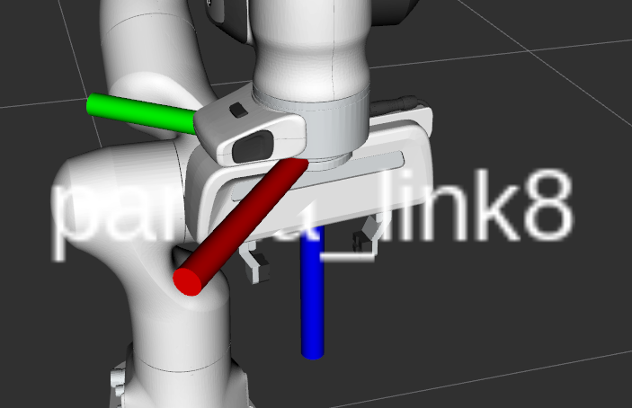
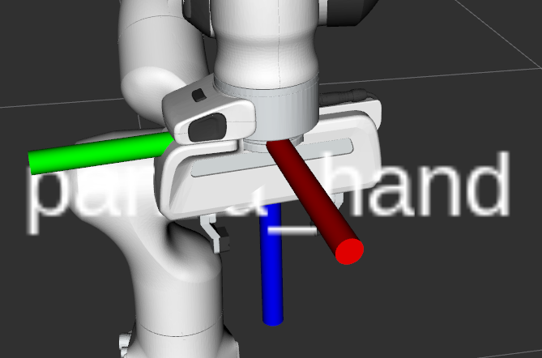
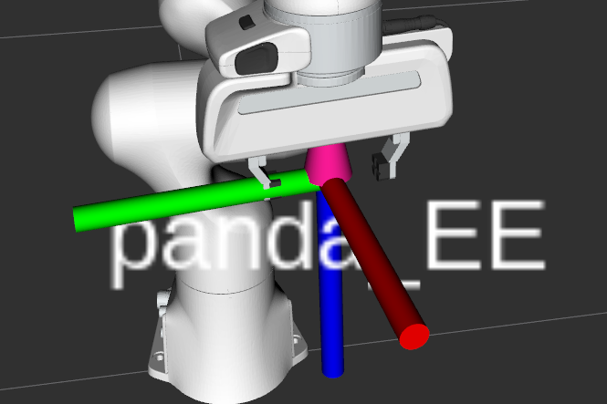
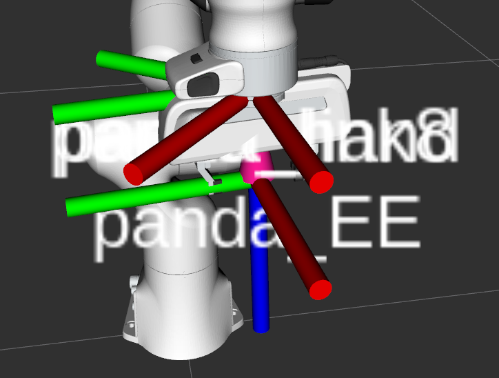

# panda_go_grasp
使用panda机械臂接收grasp pose，执行抓取和一些其他操作

接收以**桌面参考系为父坐标系**的GraspConfigList类型数据

读取列表的第一个GraspConfig类型数据（最优grasp config）


## 使用

1. 解锁机械臂

   ```bash
   cd ~/catkin_ws #where  your "panda_client.sh" is
   source panda_client.sh -r
   ```

2. 启动moveit

   ```bash
   roslaunch panda_moveit_config moveit_rviz.launch
   ```

3. 未完待续


关于末端几个坐标系位置关系如下图所示：



## 测试模式

测试模式中（命令行参数`--test`），机械臂将会执行以下操作：

> 1. 移动到设定好的初始姿态
> 1. 移动到预备抓取姿态
> 3. 沿着approach轴移动到抓取姿态，并合并夹爪
> 4. 返回预备抓取姿态
> 5. 移动到设定好的放置姿态，并打开夹爪
> 6. 循环执行2到5步骤
人为给定的抓取姿态是坐标系`panda_EE`(典范抓取坐标系形式)相对于`panda_link0`的位姿，记为$^BT_E$，由于使用`movegroup.go()`命令给规划组`panda_arm`设置的目标姿态，是坐标系`panda_link8`相对于坐标系`panda_link0`的位姿$^BT_L$，而不是$^BT_E$，因此需要分别计算出两个状态下的夹爪位姿数据：

- 预备抓取状态，坐标系`panda_link8`相对于坐标系`panda_link0`的位姿，记为$^BT_{L_p}$（脚标$p$代表预备抓取状态）
- 最终抓取状态下，坐标系`panda_link8`相对于坐标系`panda_link0`的位姿，记为$^BT_{L_g}$（脚标代表最终抓取状态）

其中，预备抓取状态，仅仅是保持抓取姿态的同时，沿抓取姿态的approach轴，向负方向后撤15cm。

计算过程为，重记给定的抓取姿态为$^BT_{E_g}$，对应的抓取预备姿态为$^BT_{E_p}$，则有
$$
^BT_{L_g}=^BT_{Eg}\times^{E_g}T_{L_g}\\
^BT_{L_p}=^BT_{Eg}\times^{E_g}T_{E_p}\times^{E_p}T_{L_p}
$$
其中，$^{E_g}T_{E_p}$代表预备抓取坐标系相对于最终抓取坐标系的位姿（代表了后撤的变换关系），且$^{E_g}T_{L_g}=^{E_p}T_{L_p}=^ET_L$，是固定机械臂参数，代表`panda_link8`坐标系相对于`panda_EE`的位姿。


## 抓取模式

