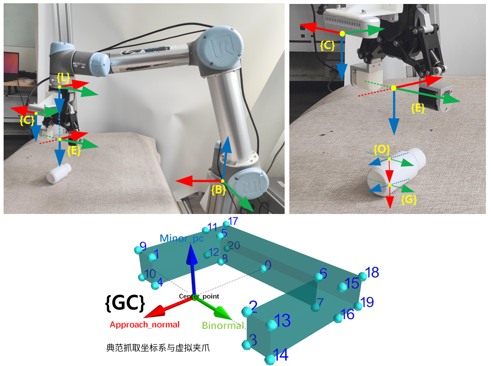

# go_grasp
基于ROS & Moveit，订阅给定的抓取位姿话题，使用链式机械臂进行抓取，代码目前在UR5机械臂上已进行了测试，未来希望也能够适配于panda机械臂。

## 基本信息

- 订阅接收数据类型为[`GraspConfigList`](https://github.com/Hymwgk/gpg/tree/master/msg)的抓取位姿话题
- 默认执行所接受话题中`GraspConfigList`格式数据中包含的第一个`GraspConfig`数据所代表的抓取
- 默认订阅的抓取位姿的形式，使用`典范抓取坐标系`形式表示


## 代码涉及的基础抓取信息




### 符号说明

以下符号基本延续在书本《机器人学导论》中的符号表示形式；

需要特别说明的是，我们设定机械臂在接收到指定的抓取位姿之后，不会直接将夹爪移动到对应的抓取位姿，而是将夹爪首先移动到一个`预备抓取姿态`，然后从该预备姿态，沿着抓取approach轴方向直线靠近抓取姿态，直至到达目标。

为了区分抓取状态和预备抓取状态时的机械臂所处的状态，我们通过对位置可变动坐标系的符号添加下标`g`（grasp抓取状态）与`p`（pre-grasp预备抓取状态）分别代表这两种不同的状态；例如，变换关系`BTE`代表坐标系{E}相对于坐标系{B}的普遍变换关系，而`BTEg`特指在抓取情形下，坐标系{E}相对于坐标系{B}的变换关系，特殊的，对于相对位置固定的坐标系`{E}`与`{L}`之间存在关系`LgTEg = LpTEp = LTE`


注意理解下文中： 情形，状态等词语的区别

### 涉及的连杆与物体（以UR5为例）

`base_link` ：ur5机械臂规划组里的基座连杆

`wrist_3_link`：ur5机械臂末端最后一个连杆

`AG95` ：使用的机械手实物，

`Realsense D435`：使用的相机实物

`GRIPPER`：虚拟夹爪

`Object`：桌面上的目标物体


### 坐标系

表征一个刚体在三维空间中的位置与姿态（位姿），可以通过在刚体上固连一个坐标系，并描述该坐标系相对于空间参考坐标系的变换关系来实现，下面解释本抓取例子中各个连杆与物体上固连的坐标系系统。


**`{GC}`**：典范抓取坐标系，固连在虚拟夹爪`GRIPPER`上，它主要描述   **在抓取情形下**  一种典型的抓取坐标系与夹爪的相对固连方式 ，不用于描述具体的抓取姿态

> - 定义，典范抓取坐标系的x轴为approach轴，y轴为闭合方向轴记为binormal，z轴为夹爪指向夹爪正面，记为minor_pc轴（使用Dex-net中定义的形式）
> - 所谓虚拟夹爪，可以认为是物理夹爪在抓取情形下的表征，代表物理夹爪在抓取情形下的状态
> - 虚拟夹爪在显示的时候，我们把它简化为图中所示的形式，它的重要的基本几何尺寸与实际夹爪形同，可以[参照这里的一些解释](https://github.com/Hymwgk/PointNetGPD)

**`{G}`**：表征抓取位姿的坐标系，与实际夹爪`AG95`的固连形式  与   {GC}和`GRIPPER`固连形式相同

> 一旦确定了该坐标系相对于一个父坐标系的位置姿态，**抓取情形下**，实际夹爪在父坐标系中的具体位置姿态也就确定了
>
> 仅在抓取情形下有意义，因此在变换关系中可省略下标`g` ，例如GgTEg=GTEg

**`{O}`**：固连于物体`Object`之上的物体坐标系（或者叫Local frame）

> 在计算过程中，我们通常无法直接计算抓取坐标系{G}相对于某个父坐标系的位姿，而是先计算出坐标系{O}的位姿，然后使用一个人为设定的变换关系OTG来推算出坐标系{G}的位姿

**`{C}`**：相机坐标系，在我们UR5的例子中，使用realsense D435的 `camera_color_optical_frame`坐标系，固连于其rgb光学镜头

> 通常，在进行抓取姿态检测时，得到的抓取位姿都是使用CTG来表示的，即，最初视觉抓取检测出的抓取一般都是以相机坐标系{C} 为父坐标系

**`{E}`** ：实际夹爪的指尖中心固连（抓取）坐标系，在我们的UR5例子中，认为坐标系{E}固连在AG95夹爪指尖中心位置处     

> - 与{G} 不同的是，坐标系{E}任何时间均会随着实际夹爪移动而移动，坐标系{G}仅在抓取情形下有意义；
>
> - 坐标系{E}与实际夹爪的固连形态可能是由系统直接指定，也可能是由自己人为指定，例如本UR5例子中，为了增加例子说明度，我们采用{L}与类似`wrist_3_link` 连杆的固连形态，因此在本例子抓取情形时，{E} 与 {G}之间存在一个确定的变换关系G**T**Eg （当然你也可以直接使用坐标系{G}与虚拟夹爪之间相同的固连形态）  以下左侧第一个是我们人为指定的固连方式
>
>   

**`{B}`**：机械臂基座连杆的固连坐标系，在UR5机械臂中，固连于`base_link`连杆

**`{L}`**：机械臂末端连杆的固连坐标系，在UR5机械臂中，固连于`wrist_3_link` 连杆


### 坐标系间的变换关系

说明： 以下的变换中，符号`T`代表`to`的含义，表示从一坐标系到另一坐标系的变换关系（变换矩阵），也可以表述为，一个坐标系相对于另一个坐标系中的位姿（位置姿态），例如，`ATB`代表坐标系`{A}`到坐标系{B}的变换，也可表述为坐标系{B}相对于坐标系{A}的位姿，以下存在一定程度的说法混用，注意分辨。


#### 基本变换关系

**`BTC`**：相机坐标系{C}相对于基座坐标系{B}的位置姿态，手眼标定之后即可确定；

> 实际上，如果是眼在手上的形式，手眼标定其实是确定了关系`LTC` ，关系`BTC`则由BTC=BTL*LTC  实时计算确定，其中`BTL`由正运动学计算得到
>
> 在ROS中，我们可以使用TF直接读取该变换关系

**`CTG`**：抓取坐标系{G}在相机坐标系{C}中的位姿，即，所订阅话题中的目标抓取位姿的表示形式

**`GTEg`**：**抓取情形下**，抓取坐标系`{G}`相对于实际夹爪指尖固连坐标系`{E}` 的变换关系

**`LTE`**：指尖坐标系`{E}`与末端连杆固连坐标系`{L}`之间的变换关系，是一个由物理机械结构尺寸确定的固定变换关系

> 例如本例子中，AG95夹爪结构尺寸确定，且固定连接在`wrist_3_link`连杆上，因此该变换是一个固定值

**`EgTEp`**：坐标系{E}在预备抓取与抓取情形下  之间的变换关系，为人为设定的固定值


#### 中间变换关系解释

**`BTEg`**：特指抓取情形下，实际夹爪指尖抓取坐标系`{E}`，相对于机械臂基座固连坐标系`{B}`的位姿

> 在代码中，我们使用以下表示形式，将变换关系拆分为平移和旋转
>
> - `BTEg_rot`：变换矩阵`BTEg`的旋转分量
>
> - `BTEg_trans`：变换矩阵`BTEg`的位置分量，以下变换同理，省略不写

**`BTEp`**：特指预备抓取情形下，实际夹爪指尖抓取坐标系`{E}`，相对于机械臂基座固连坐标系`{B}`的位姿


#### 求解的目标变换关系

在进行手眼标定之后，我们可以使用正运动学，实时读取关系**`BTC`**，并结合给出的抓取位姿变换CTG，使用上述**基本变换关系**计算出抓取与预抓取情形下，机械臂末端执行器的变换关系`BTEg`与`BTEp` ，进而计算出以下两个关系`BTLg`与`BTLp`  ，最终使用Moveit进行机械臂各关节逆运动学解，并规划运动轨迹。

**`BTLg`**：抓取情形下，机械臂末端连杆上的固连坐标系`{L}`，相对于机械臂基座固连坐标系`{B}`的位姿，例如抓取情形下ur5机械臂中的`wrist_3_link`坐标系，相对于`base_link`坐标系的位姿

**`BTLp`**：预备抓取情形下，`wrist_3_link`固连坐标系`{L}`，相对于机械臂基座`base_link`固连的坐标系`{B}`的位姿


### 人为设定参数与条件

#### 给定的约束条件

- 我们人为指定抓取情形下，抓取坐标系{G}与虚拟夹爪的固连方式 采取  典范抓取坐标系形式

  > **该设定条件的必要性：**在抓取执行环节中，不同的机械臂的夹爪指尖中心固连坐标系{E}可能是不同的；为了将抓取检测与抓取执行环节脱耦，我们需要设定抓取检测环节产生的抓取坐标系与夹爪的统一固连方式，这个条件的设定通常是在抓取检测环节确定的（Dex-net与PointNetGPD均使用与本UR5例子相同的形式），抓取执行环节仅需根据关系`GTEg`即可得到抓取情形下，物理实际夹爪的位置姿态

  

#### 根据硬件实际尺寸，给定参数

- 变换关系**`LTE`**：在本UR5例子中，由于AG95是第三方厂商生产的，并非标准配件，因此我们需要自己去根据夹爪硬件尺寸参数指定该变换关系，为方便起见，我们以ROS系统中`ur5_ moveit_config`程序包中给出的坐标系{L}为参考系，设定{E}相对于{L}仅存在一个沿z轴正向的偏移量`offset = 0.1034`，姿态不发生旋转

  > 如果使用自带标准夹爪，一般情况下，在ROS的Moveit配置包中，会有一个厂家设定好的指尖中心抓取坐标系，例如使用panda机械臂的自带电动夹爪时，可以直接选定坐标系{E}为预设的`panda_EE`坐标系，可以使用TF直接读取变换关系**`LTE`**即可，而不需人为设定

- 变换关系**`GTEg`**：坐标系{E}与实际夹爪的固连形式，以及坐标系{G}与虚拟夹爪的固连形式都是我们自己设定的，因此需要指定在抓取情形下，两者存在的此固定变换关系

- 变换关系**`OTG`**：计算{G}的位姿，通常需要先计算出坐标系{O}的位姿，我们设定坐标系{G}相对于{O}仅在x轴正向存在一个偏移量，姿态不发生偏转
- 变换关系**`EgTEp`**：坐标系{E}在预备抓取与抓取情形下  之间的变换关系，我们设定两种情形下，{Ep}相对于{Eg}仅存在z轴负方向的一个偏移`retreat = 0.15`，姿态不发生偏转

#### 外部输入抓取表示形式

约定，外部输入的抓取姿态，统一使用`CTG`的形式表示，固连方式使用典范抓取坐标系形式。


### 目标变换计算过程

本代码中，接收的话题中的抓取位姿的表示，是使用CTG来表示的，**目标是**，根据坐标系之间的变换关系，求出在抓取情形和预备抓取情形下的变换关系`BTLg`与`BTLp`，通过间接对`wrist_3_link`连杆进行轨迹规划并移动，使得在预备抓取和抓取情况下，夹爪与基座满足变换关系`BTEg`，具体变换链条为


1. 根据手眼标定得到的BTC 计算抓取坐标系{G}在基座坐标系下的位姿`BTG=BTC*CTG`
2. 根据变换关系`GTEg`计算得到在抓取情形下，夹爪坐标系{E}相对于基座的位姿`BTEg=BTG*GTEg`
3. 根据变换关系`EgTEp`计算得到在预备抓取情形下，夹爪坐标系{E}相对于基座的位姿`BTEp=BTEg*EgTEp`
4. 对末端连杆与夹爪的相对位姿关系`LTE`求逆得到`ETL`
5. 根据`ETL`计算得到抓取情形下，末端连杆在基座坐标系下的位姿`BTLg=BTEg*ETL`
6. 根据`ETL`计算得到预备抓取情形下，末端连杆在基座坐标系下的位姿`BTLp=BTEp*ETL`


## UR5机械臂执行抓取

### 仿真环境测试抓取

此时并不真正抓取，仅仅执行一个固定动作

1. 启动仿真环境

   ```
   roslaunch  ur5_moveit_config  demo.launch
   ```

 2. 启动go_grasp 节点  (python 2.7)

    ```
    roslaunch     go_grasp    go_grasp.launch  robot_name:='ur5'   mode:='test' 
    ```


### 仿真环境抓取

订阅外部节点发布的抓取信息，并在虚拟环境中执行抓取； 需要提前发布 抓取话题 以及发布手眼位姿关系；这里以一个realsense D435眼在手上安装方式为例，


1. 对UR5进行[手眼标定](https://github.com/Hymwgk/ur5_hand_eye_calibrate)

2. 发布手眼标定关系

   ```
   roslaunch ur5_hand_eye_calibrate publish_ur5_eoh.launch
   ```

3. (python 3.8.5) 检测桌面目标物体并发布抓取信息，这里以一个简单的用YOLO v5检测目标并执行抓取的代码为例，注意，这里使用yolo_v5检测了3-Dof的平面抓取位姿，但是本仓库的代码可以执行6-DOF的抓取，仅需要替换掉这里使用检测节点，使用自己的GPD算法发布6-dof抓取位姿即可；

   **Tip：**如果想观察6-Dof的效果，可以查看我的[这个仓库](https://github.com/Hymwgk/gpg)，融合了gpg与PointNetGPD两部分的代码

   ```
   roslaunch  yolov5_ros  yolo_v5.launch
   ```

4. 安装UR5的Moveit相关程序包，并启动仿真环境

    ```
    roslaunch  ur5_moveit_config  demo.launch   
    ```

2. (python 2.7) 启动go_grasp节点，观察抓取效果，在使用自己的gpd算法时，注意要根据自己的代码以及实际硬件修改`launch`文件中的参数，具体参数含义可以查看`go_grasp.py`中的详细注释

   ```
   roslaunch go_grasp go_grasp.launch  robot_name:='ur5'   mode:='run' 
   ```

   

### 实机抓取

1. 解锁机械臂

   ```bash
   roslaunch ur_robot_driver ur5_bringup.launch robot_ip:=192.168.1.110 
   ```
   
2. 在机械臂端启动底层接口

   
   
3. 启动moveit

   ```
   roslaunch   ur5_hand_eye_calibrate   ur5_moveit_rviz.launch
   ```

4. 启动


